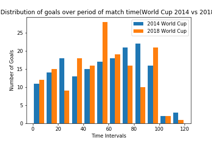

# Distribution of goals over period of match time(World Cup 2014 vs 2018)

### Dataset
- Link: https://github.com/openfootball/world-cup.json
- Type: CSV

### Tools/Libraries
- Pandas
- Numpy
- Matplotlib

### Visualisations

1. Distribution of goals over period of match time(World Cup 2014 vs 2018)

