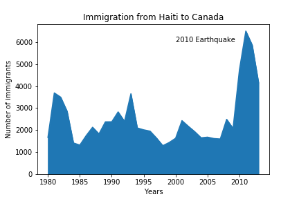
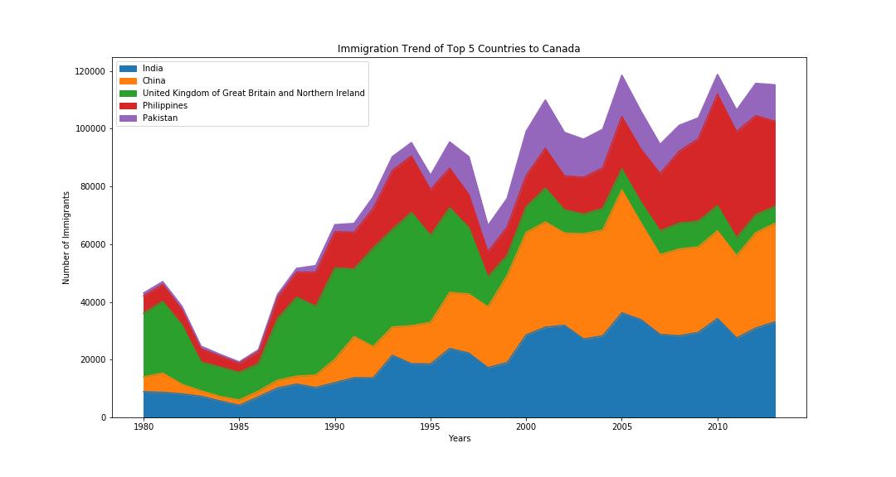

# Immigration Trend to Canada

### Dataset
- Link:  https://ibm.box.com/shared/static/lw190pt9zpy5bd1ptyg2aw15awomz9pu.xlsx
- Type: Excel

### Tools/Libraries
- Pandas
- Numpy
- Matplotlib

### Visualisations

1. Spike in immigartion form Hailti to Canada in 2010 due to earthquake

2. Immigration trend of top 5 countries to Canada from 1980 to 2013

